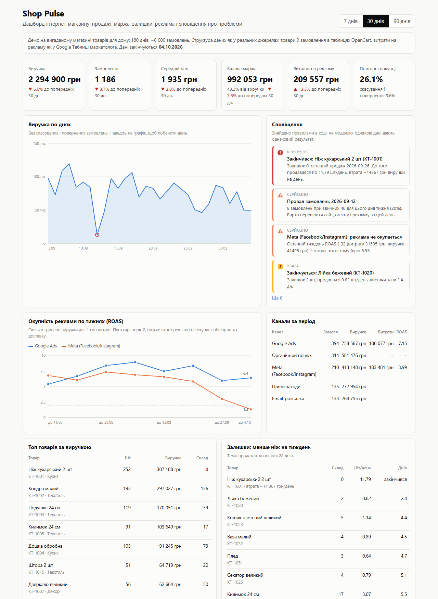
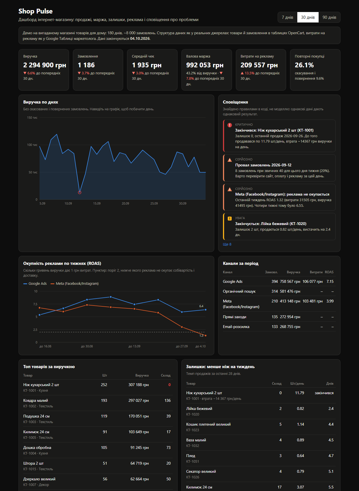
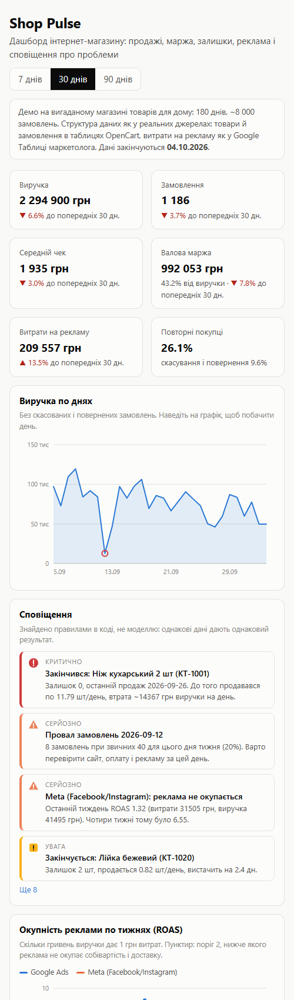

# Shop Pulse

An online-shop dashboard that joins store data (OpenCart orders and products) with ad spend
(a marketer's Google Sheet), raises alerts when something breaks, and lets the owner ask
questions in plain Ukrainian. The AI assistant cannot invent numbers silently: after every
answer, code checks each number and date against the data the assistant actually fetched.

**Live demo:** https://shop-pulse-demo.vercel.app (UI in Ukrainian)



The shop is fictional and the data is generated (180 days, 8 000+ orders, 84 products). The
tables keep the shape of the real sources, so connecting a real OpenCart database means
replacing `world.py`, not the dashboard.

## What it does

| Part | How | Why this way |
|---|---|---|
| KPIs | revenue, orders, average check, gross margin, ad spend, repeat buyers, cancellations; each compared with the previous equal period | the comparison is what turns a number into a signal |
| Alerts | rules in code: best seller out of stock (with lost revenue per day), a day with orders below 60% of the same-weekday median, a paid channel with weekly ROAS under 2, items with less than 7 days of stock | same data, same answer; testable; the model never decides what is a problem |
| Ad payback | weekly ROAS per channel next to a monthly table | a monthly average hides a fresh collapse (see below) |
| AI assistant | the model calls 7 whitelisted functions, the same ones that draw the dashboard, with Pydantic-validated arguments; no SQL, no database access | it can only see what the owner sees |
| Number check | every number and date in the answer is matched against the tool results (rounding tolerated) | an invented or self-computed number is shown to the user as "not found in data" |

Three problems are planted in the data on purpose, so the alert rules are tested against a
known answer: the best seller runs out on 27.09, the checkout breaks on 12.09 (orders at
20% of normal), and Meta spend keeps growing for three weeks while its orders fall. The
tests assert that exactly these three serious alerts fire and nothing else serious does.

## Measured

Assistant on `openai/gpt-oss-120b` (Groq), 15 questions with known answers
([`eval/run_eval.py`](eval/run_eval.py), raw answers in [`eval/results.json`](eval/results.json)):

| Metric | Result |
|---|---|
| Called the tool needed to answer | 15 / 15 |
| Answer contains the expected fact | 14 / 15 |
| Answers where every number was found in the data | 14 / 15 (49 numbers checked, 1 not found) |
| Latency, median / p95 | 1.3 s / 6.4 s |
| Cost per 1 000 questions | $0.42 |

The two misses, as they are: one answer wrote the date as `12 09 2026`, which the checker
does not parse, so it was flagged; another named the product "ніж кухарський" without its
variant, which the strict fact match did not accept. Both answers were right in substance.

Tests: 32, no network, no API key, run under a 1 GB memory cap in Docker
(`scripts/run_tests_capped.ps1`) and in GitHub Actions.

## Where it breaks / limits

- **The monthly average lied about Meta.** Asked "is Meta paying off?", the first version
  answered from the 30-day table: ROAS 3.99, fine. The last week was 1.32. The prompt now
  sends payback questions to the weekly tool as well, and the eval requires `1.32` in the
  answer. A prompt rule is weaker than code: the alert rule catches it regardless.
- **The model computes its own numbers.** In a manual run it divided revenue by orders and
  reported an average check of 1 604 UAH that exists nowhere in the data. The checker flagged
  it. The prompt now forbids derived numbers, but the check stays, because the prompt is a
  request, not a guarantee.
- **Typography broke the checker.** The model writes non-breaking spaces and hyphens
  (`2 294 900`, `2026‑09‑26`); without normalisation real numbers were reported as
  unverified. Fixed and covered by a test.
- **Rate limits are per serverless instance.** 10 questions per hour per IP and 200 per day
  live in memory; a cold start resets them. Good enough for a demo that spends cents, not
  for a paid product (that needs a shared store).
- The 15-question eval is small; it shows the method, not a guarantee.

## What I would do next

1. Real connectors: OpenCart through its database or API, Google Sheets through a service
   account, the shop's CRM; scheduled sync into Postgres, with an idempotent load per day.
2. Alerts to Telegram or email on a schedule, with a mute per alert.
3. Store each question, answer and check result, so the eval grows from real questions.

## Run locally

```bash
pip install -r requirements-dev.txt
PYTHONPATH=src uvicorn shoppulse.web:app --port 7860
# assistant: set GROQ_API_KEY in the environment (see .env.example)
```

Stack: Python, FastAPI, SQLite (in memory, built on start), Pydantic, httpx, hand-drawn SVG
charts, Groq. Deployed on Vercel as one Python function.

| Dark mode | Phone |
|---|---|
|  |  |
